# Phase Dependency Graph (C1)

```mermaid
graph TD
    phase00[phase00_preflight]
    phase02[phase02_context]
    phase_econ[phase01_daily_economy]
    phase_welfare[phase01_daily_welfare]
    phase_sponsors[phase01_daily_sponsors]
    phase_drama[phase01_daily_drama]
    phase_micro[phase01_daily_micro]
    phase_bouts[phase01_basho_bouts]
    phase_train[phase01_week_training]
    phase_health[phase01_week_health]
    phase_welf_w[phase01_week_welfare]
    phase_npc[phase01_week_npc_ai]
    phase_gov[phase01_week_governance]
    phase_recruit[phase01_week_recruitment]
    phase_rival[phase01_week_rivalries]
    phase_circuit[phase01_week_world_circuit]
    phase05[phase05_monthly_boundary]
    phase_market[phase01_monthly_market]
    phase06[phase06_yearly_boundary]
    phase_narrative[phase06_narrative]
    phase_assess[phase_pre_basho_assessment]
    phase_sched[phase_pre_basho_schedule]

    phase00 -->|boundaries, deltas, activeModifiers| phase02
    phase00 -->|boundaries, deltas| all_phases[All Phases]
    phase02 -->|activeModifiers| phase_train
    phase02 -->|recoveryMultiplier| phase_health
    phase_econ -->|heya.funds| phase_welfare
    phase_welfare -->|rikishi state| phase_sponsors
    phase_sponsors -->|sponsor satisfaction| phase_drama
    phase_micro -->|fused: econ→welfare→sponsors→drama| phase_drama
    phase05 -->|market state| phase_market
    phase_assess -->|rikishi assessments| phase_sched
```



## Adjacency List

```
phase00_preflight → [all phases] (sets transientContext.boundaries, deltas, activeModifiers)
phase02_context → [phase01_week_training] (consumes activeModifiers)
phase02_context → [phase01_week_health] (consumes recoveryMultiplier)
phase01_week_economy → [phase01_week_welfare] (heya.funds affect welfare checks)
phase05_monthly_boundary → [phase01_monthly_market] (market state)
phase01_daily_economy → [phase01_daily_welfare] (fused in phase01_daily_micro)
phase01_daily_welfare → [phase01_daily_sponsors] (fused in phase01_daily_micro)
phase01_daily_sponsors → [phase01_daily_drama] (fused in phase01_daily_micro)
phase_pre_basho_assessment → [phase_pre_basho_schedule] (rikishi assessments)
```
