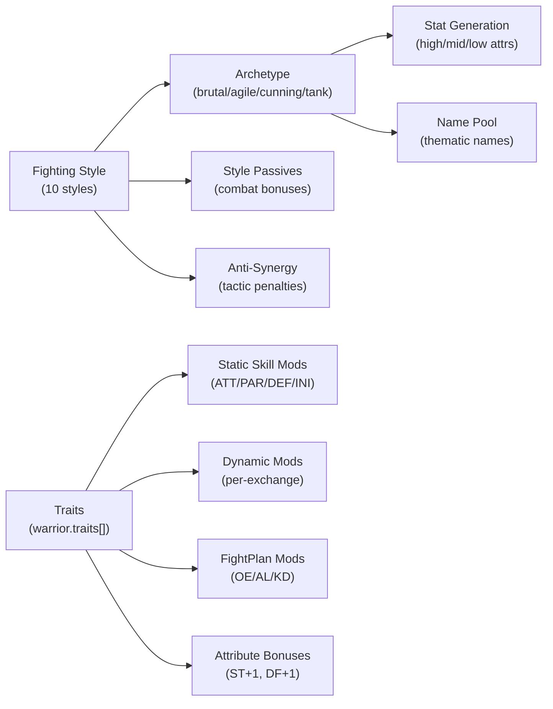

# Trait × Archetype × Style Interaction Audit

## System Architecture

Three systems interact to define a warrior's combat identity:



### Style → Archetype Mapping
| Archetype | Styles | High Stats | Low Stats |
|-----------|--------|------------|-----------|
| brutal | BashingAttack, StrikingAttack | ST, CN, SZ | WT, SP, DF |
| agile | LungingAttack, SlashingAttack | SP, DF, WT | CN, SZ, WL |
| cunning | AimedBlow, ParryRiposte, ParryLunge, ParryStrike | WT, DF, WL | ST, CN, SZ |
| tank | TotalParry, WallOfSteel | CN, WL, SZ | WT, SP, DF |

---

## Issues Found

### 🔴 Issue 1: Dual Trait Registries with Casing Mismatch

There are **two separate trait data sources** that don't agree on IDs:

| System | Source | IDs | Used By |
|--------|--------|-----|---------|
| Recruitment | `PERSONALITY_TRAIT_DATA` in [personalityTraits.ts](file:///Users/amauricia/Documents/GitHub/stable-lords/src/data/personalityTraits.ts) | `"Aggressive"`, `"Disciplined"`, `"Cunning"` (PascalCase) | `recruitment.ts` line 129 |
| Combat Engine | `TRAITS` in [traits.ts](file:///Users/amauricia/Documents/GitHub/stable-lords/src/engine/traits.ts) | `"aggressive"`, `"disciplined_mind"`, `"cunning"` (snake_case) | `fighterState.ts`, `resolution.ts` |

**The recruitment pipeline writes PascalCase IDs** (`traits: ["Aggressive"]` at line 166) but **the combat engine looks up snake_case IDs** (`TRAITS["aggressive"]`). This means:

> [!CAUTION]
> **Recruited warriors' personality traits are silently ignored in combat.** The combat engine's `getStaticTraitMods`, `getDynamicTraitMods`, and `getTraitFightPlanMods` all look up trait IDs from `TRAITS`, which uses snake_case keys. A warrior recruited with `traits: ["Aggressive"]` will never match `TRAITS["Aggressive"]` because that key doesn't exist — only `TRAITS["aggressive"]` does.

This is the **most critical issue** — it means the entire personality trait system is inert for warriors generated through the recruitment pipeline (which is every non-orphanage warrior).

**Evidence chain:**
1. `recruitment.ts:129` → `rng.pick(PERSONALITY_TRAITS)` → picks from `Object.keys(PERSONALITY_TRAIT_DATA)` → `"Aggressive"` (PascalCase)
2. `recruitment.ts:166` → `traits: [trait]` → stores `["Aggressive"]` on warrior
3. `traits.ts:284` → `for (const id of warrior.traits)` → looks up `TRAITS["Aggressive"]` → **undefined** → skipped

### 🔴 Issue 2: Double-Dipping Attribute Bonuses

The `PERSONALITY_TRAIT_DATA` in `personalityTraits.ts` and `TRAITS` in `traits.ts` **both define `attrBonus`** for the same conceptual trait:

| Trait | personalityTraits.ts attrBonus | traits.ts attrBonus | Applied Where |
|-------|-------------------------------|---------------------|---------------|
| Aggressive | `{ ST: 1, WL: 1 }` | `{ ST: 1, WL: 1 }` | recruitment.ts L131-134 |
| Cunning | `{ SP: 1, DF: 1 }` | `{ SP: 1, DF: 1 }` | recruitment.ts L131-134 |
| Brutal | `{ ST: 2 }` | `{ ST: 2 }` | recruitment.ts L131-134 |

Currently this is NOT double-dipping because of Issue 1 (the combat engine can't find the PascalCase traits). But **once Issue 1 is fixed**, `attrBonus` from `traits.ts` would need to be handled carefully or the bonus would apply twice:

1. **Once at recruitment** (recruitment.ts L131-134 applies `PERSONALITY_TRAIT_DATA[trait].attrBonus` directly to `attributes`)
2. **Potentially again at combat** if `traits.ts` `attrBonus` is ever consumed (currently it's defined in the schema but `getStaticTraitMods` doesn't read it)

> [!IMPORTANT]
> `getStaticTraitMods` in `traits.ts` does NOT currently consume `attrBonus` — it only reads skill mods. But the field exists on `TraitEffect` and could confuse future development. The `attrBonus` in `personalityTraits.ts` is the one that actually takes effect (at recruitment time, baked into base attributes).

### 🟡 Issue 3: Trait Generation is Archetype-Blind

Trait assignment in recruitment (`rng.pick(PERSONALITY_TRAITS)` at line 129) is **completely random** — there's no weighting by archetype. This creates frequent mismatches:

| Mismatch | Why It Hurts |
|----------|-------------|
| `Brutal` trait on `cunning` archetype (AB/PR/PL/PS) | OE+8 pushes a finesse style into reckless aggression; low ST means damage bonus is wasted |
| `Evasive` trait on `brutal` archetype (BA/ST) | AL+10, OE-5 turns a power style into a passive dodger; low SP/DF means evasion fails |
| `Sturdy` trait on `agile` archetype (LU/SL) | OE-2, AL-3, KD-5 removes all offensive impetus from a burst-damage style |
| `Feral` trait on `tank` archetype (TP/WS) | OE+6, KD+10 turns a defensive wall into a reckless attacker with poor ATT skills |

**This isn't necessarily a bug** — it could be intentional design (personality ≠ body type). But from the balance audit, we know these mismatches cause ±10pp W% swings that players can't control or predict.

### 🟡 Issue 4: `warriorFactory` vs `recruitment` Use Different Trait Systems

| Path | Trait Source | Stored As | Combat Effect |
|------|-------------|-----------|---------------|
| `makeWarrior()` | `generateTraits(rng)` from `traits.ts` | snake_case IDs | ✅ Works — combat engine finds them |
| `generateRecruit()` | `rng.pick(PERSONALITY_TRAITS)` from `personalityTraits.ts` | PascalCase IDs | ❌ Broken — combat engine can't find them |
| Orphanage FTUE | `rng.pick(PERSONALITY_TRAITS)` from `orphanPool.ts` | PascalCase IDs | ❌ Broken — same issue |

Warriors created via `makeWarrior` (e.g. in tests) get combat-effective traits. Warriors created via `generateRecruit` (the actual game) get decorative-only traits.

---

## Proposed Fix

### Phase 1: Unify Trait Registry (Critical)

> [!IMPORTANT]
> Eliminate the dual-registry by making `personalityTraits.ts` a consumer of `traits.ts`, not a parallel definition.

#### [MODIFY] [recruitment.ts](file:///Users/amauricia/Documents/GitHub/stable-lords/src/engine/recruitment.ts)

Replace the `PERSONALITY_TRAIT_DATA` import and manual trait application with the unified `TRAITS` registry from `traits.ts`:

- Import `TRAITS, generateTraits` from `@/engine/traits` instead of `PERSONALITY_TRAIT_DATA`
- Use `generateTraits(rng)` for trait generation (same as `makeWarrior`)
- Remove the manual `attrBonus` application (lines 131-135) — attributes are already baked into base stats by the breakpoint system, and skill bonuses flow through `getStaticTraitMods` at combat time
- OR if `attrBonus` is desired at recruitment, loop `TRAITS[id].effect.attrBonus` instead of `PERSONALITY_TRAIT_DATA`

#### [MODIFY] [personalityTraits.ts](file:///Users/amauricia/Documents/GitHub/stable-lords/src/data/personalityTraits.ts)

Two options:
- **Option A (preferred):** Delete this file and migrate all consumers to `traits.ts`. The combat engine is the source of truth.
- **Option B:** Keep as a display-only data source (descriptions, names) but re-key to snake_case and add cross-references to `TRAITS`.

### Phase 2: Archetype-Aware Trait Weighting (Enhancement)

Add optional archetype affinity to `TraitDef`:

```typescript
export interface TraitDef {
  // ... existing fields ...
  /** Archetypes this trait synergizes with (higher pick chance). */
  archetypeSynergy?: Archetype[];
  /** Archetypes this trait anti-synergizes with (lower pick chance). */
  archetypeAntiSynergy?: Archetype[];
}
```

Then update `generateTraits` to weight by archetype:

| Trait | Synergy | Anti-Synergy |
|-------|---------|-------------|
| aggressive, brutal, feral, merciless | brutal | cunning, tank |
| cunning, calculated, evasive | cunning, agile | brutal |
| sturdy, resilient | tank | agile |
| disciplined_mind | cunning, tank | — |
| quick, agile | agile | — |
| heavy_handed, combo_artist | brutal | — |
| patient, stalwart | tank, cunning | — |

This doesn't prevent mismatches (20-30% chance to pick off-archetype), but it makes thematic fits more common while preserving interesting "against-type" warriors.

### Phase 3: Remove `attrBonus` from Combat Traits (Cleanup)

Move `attrBonus` out of `TraitEffect` and into a separate `TraitRecruitmentEffect` or similar. Attribute bonuses should only be applied at warrior creation (changing base attributes mid-combat would be architecturally unsound), and having them on `TraitEffect` alongside skill mods is misleading.

---

## Open Questions

> [!IMPORTANT]
> 1. **Should personality mismatches be possible?** A `Feral` TotalParry fighter is thematically interesting but mechanically awful. Should generation prevent this, weight against it, or keep it as a roster management challenge?
> 
> 2. **Should the attrBonus be kept at recruitment?** Currently `Brutal` adds +2 ST to the warrior's base attributes at creation time. This compounds with the archetype stat generation. If a brutal-archetype BA gets `Brutal`, they get ST from archetype (high roll ~11-14) plus +2 from trait = up to 16 ST. Is this desired stacking?
> 
> 3. **Should traits from the orphanage be migrated?** The FTUE orphanage also uses `PERSONALITY_TRAITS` (PascalCase). These warriors would also have inert traits in combat.

## Verification Plan

### Automated Tests
1. Run existing balance test suite: `npx vitest run src/test/engine/combat/traitBalance.test.ts`
2. Run full suite: `npm run test`
3. Add a new test that creates a warrior via `generateRecruit`, then verifies `TRAITS[warrior.traits[0]]` resolves to a valid `TraitDef` (currently would fail)

### Manual Verification
- Create a recruit in-game, inspect their traits, and verify the trait badge matches a key in `TRAITS`
